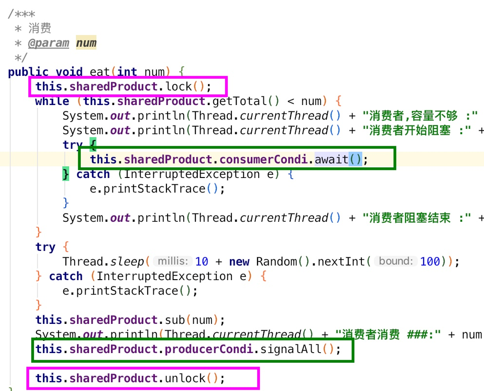

# multi_thread
java多线程编程和线程安全

## 参考
[https://blog.csdn.net/evankaka/article/details/70568951](https://blog.csdn.net/evankaka/article/details/70568951)

[http://www.importnew.com/21282.html](http://www.importnew.com/21282.html)
[http://www.importnew.com/27167.html](http://www.importnew.com/27167.html)

## 生产者消费者
### com.kunlunsoft.thread.wait_notify
生产者调用 this.sharedProduct.notifyAll() 时,也会把其他的生产者唤醒;

解决方法:使用 Condition

### com.kunlunsoft.thread.wait_notify2
使用 Condition
生产者只能唤醒消费者,消费者只能唤醒生产者

